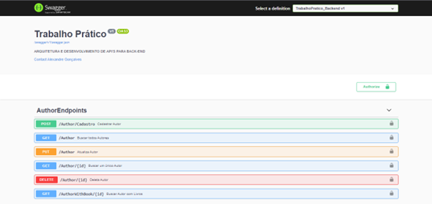
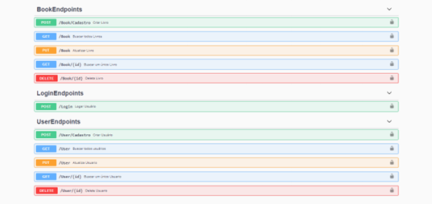
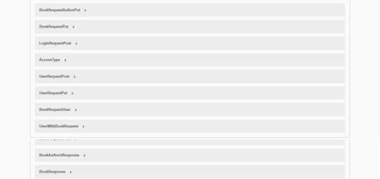
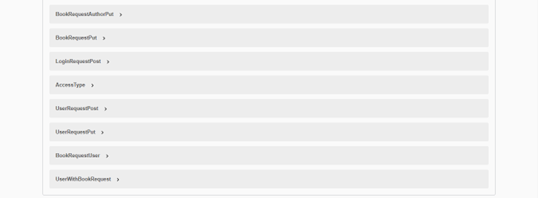
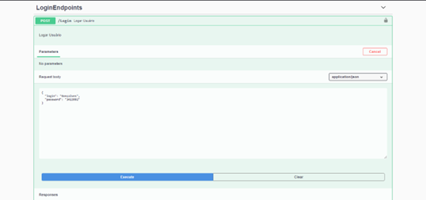
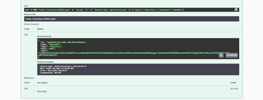
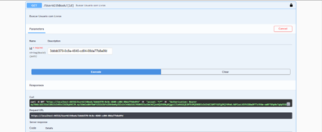
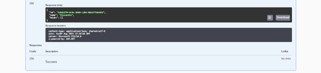

<h1 align="center"></h1>
<h1 align="center"> Trabalho Prático-Backend-UNINTER </h1>

<h2> Desenvolver uma <strong> API WEB REST/RESTFUL</strong> com <strong>Entity Framework</strong> no Visual Studio, utilizando a linguagem C# com os seguintes atributos:</h2>
 
<h3> I. Utilizar os comandos do protocolo HTTP (GET, POST, PUT, DELETE) com manipulação utilizando SEUS DADOS ( SEU NOME; SEU RU; SEU CURSO; ). Além disto, deverá conter uma lista de livros fictícia com os dados três livros do seu  curso ( Dispositivos Móveis). Deverá dar acesso para inserir ou modificar ou excluir na página da WEB.</h3>
 

<h4 align="center"></h4>
<h4 align="center"></h4>
<h4 align="center"></h4>
<h4 align="center"></h4>

  
<h3> II. Adicionar medida de proteção, como a autenticação do usuário, login ( SEU ÚLTIMO NOME) e senha ( RU DO ALUNO)</h3>
 

<h4 align="center"></h4>
<h4 align="center"></h4>

  
<h3> III. Fazer ligação com o banco de dados para guardar os dados gravados.</h3>
 

<h4 align="center"></h4>
<h4 align="center"></h4>

  
<h2> <strong> TODOS OS ITENS DEVERÃO SER APRESENTADOS CONFORME O ITEM 5. NÃO ESQUEÇAM DE FAZER COMENTÁRIOS NO CÓDIGO.</strong></h2>
